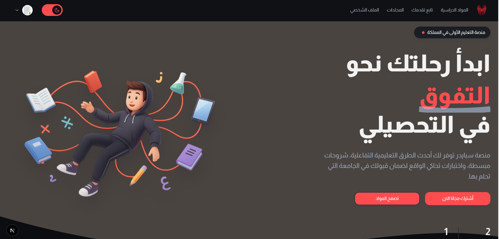
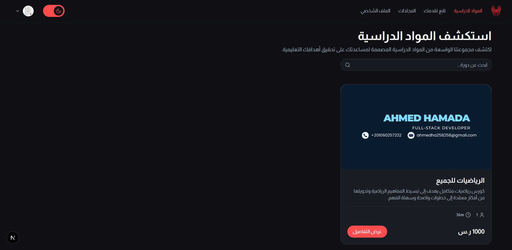
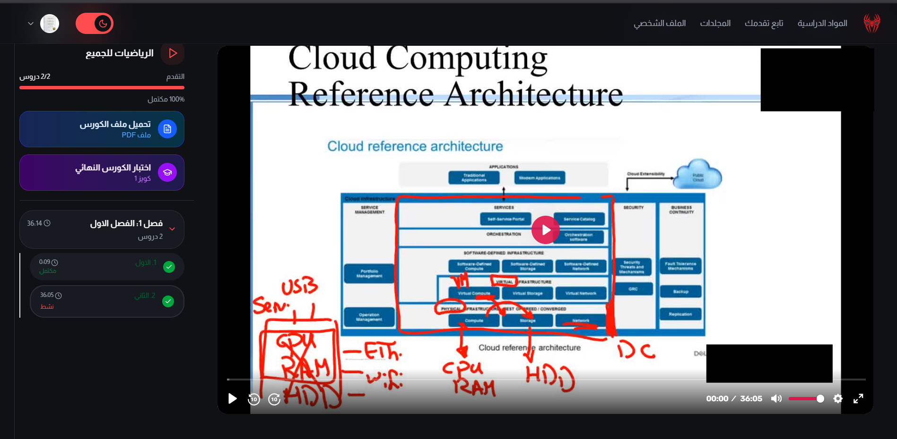
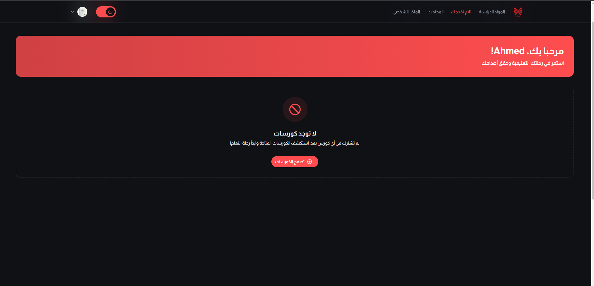
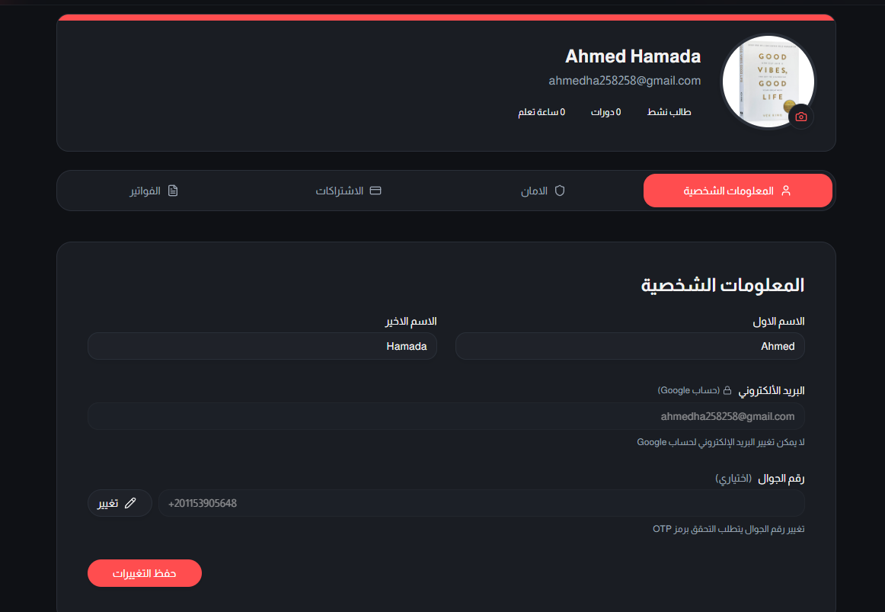
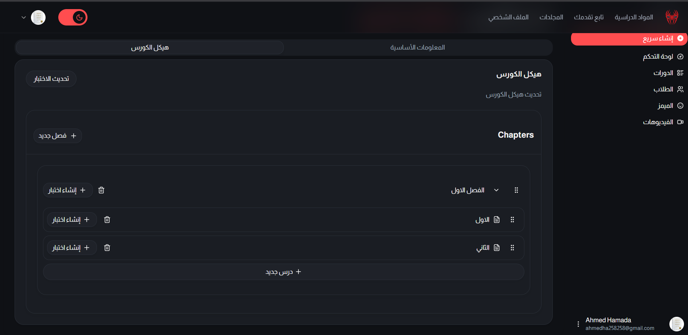
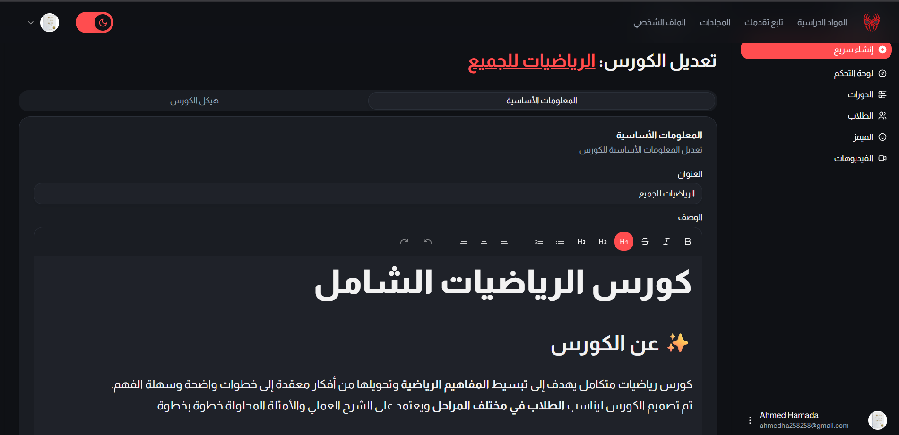
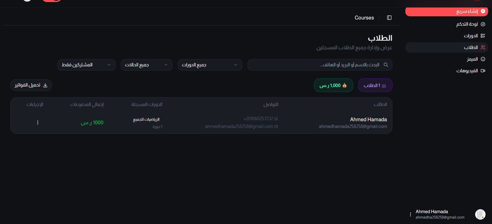

# Course Platform – Full-Stack Learning Management System

A modern, scalable online learning platform built to deliver high-quality courses with advanced analytics, secure payments, and gamified assessments.

**Live Demo:** https://fy.sa

---

## Key Highlights

- Complete Learning Management System (LMS)
- Integrated Payments with Apple Pay (Moyasar)
- Advanced Analytics Dashboard
- Gamified Quiz Engine
- High-performance Video Streaming (Bunny)
- Secure Authentication and Role Management
- Fully Responsive User Interface

---

## Tech Stack

- **Framework:** Next.js 15 (App Router)
- **Language:** TypeScript
- **Styling:** Tailwind CSS, Radix UI, Framer Motion
- **State Management:** TanStack Query
- **Database:** PostgreSQL with Prisma
- **Authentication:** Better Auth, Google OAuth, WhatsApp OTP (Twilio)
- **Forms:** React Hook Form and Zod
- **Video Streaming:** Bunny Stream
- **Charts & Utilities:** Recharts, date-fns, Sonner

---

## Screenshots

### Landing Page

### Courses & Lessons

### Student Dashboard

### Admin Dashboard

---

## Core Features

### Course Management

- Create, edit, publish, and archive courses
- Drag and drop curriculum builder
- Discount and coupon system
- Draft and publish workflow

### Video and Lessons

- Secure video streaming
- Free preview lessons
- Learning progress tracking
- Rich lesson content support

### Quiz and Assessment System

- Multi-level quizzes (Course, Chapter, Lesson)
- Smart performance-based feedback system
- Media-supported question bank
- Attempt history and analytics

### Student Experience

- Personalized dashboard
- Favorites and revision folders
- Custom exam builder
- Enrollment and payment tracking
- Detailed learning statistics

### Admin Dashboard

- Centralized content management
- Role-based access control
- User and course analytics
- Media management

---

## Project Impact

- Designed for scalable multi-course platforms
- Optimized for performance and SEO
- Production-ready system architecture
- Supports high-traffic and media-rich applications

---

## Author

Developed by **Ahmed Hamada**  
Open for freelance and full-time opportunities
